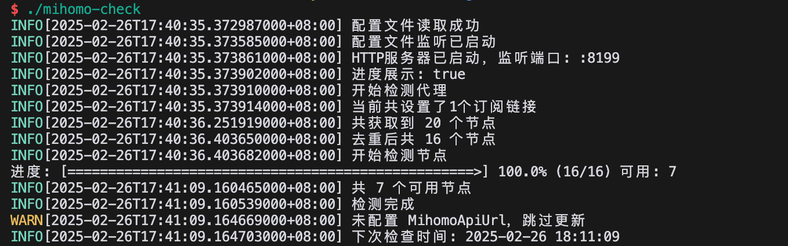
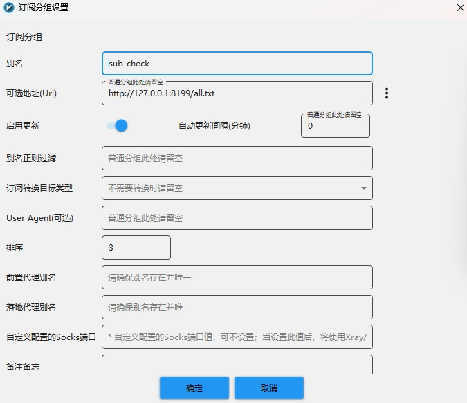
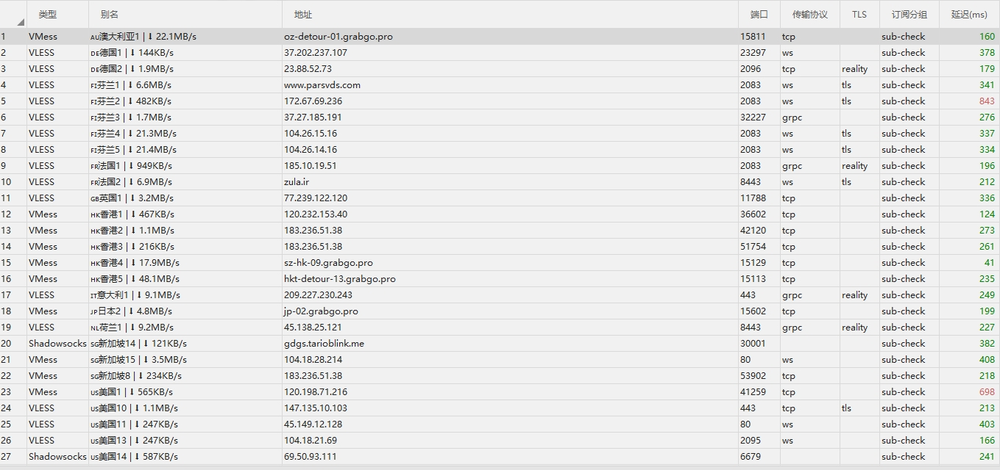

# 订阅合并转换检测工具

对比原项目是修复了一些逻辑、简化了一些东西、增加了一些功能

## 预览




## 功能

- 检测节点可用性,去除不可用节点
- 检测平台解锁情况
    - openai
    - youtube
    - netflix
    - disney
- 合并多个订阅
- 将订阅转换为clash/mihomo/base64格式
- 节点去重
- 节点重命名
- 节点测速（单线程）
- 根据解锁情况分类保存
- 支持外部拉取结果（默认监听 :8199）

## 特点

- 支持多平台
- 支持多线程
- 资源占用低

## TODO

- [x] 适配多种订阅格式
- [ ] 支持更多的保存方式
    - [x] 本地
    - [x] cloudflare r2
    - [x] gist
    - [x] webdav
    - [x] http server
    - [ ] 其他

## 使用方法
> 如果拉取订阅速度慢，可使用通用的 `HTTP_PROXY` `HTTPS_PROXY` 环境变量加快速度；此变量不会影响节点测试速度

### docker运行

```bash
docker run -d --name subs-check -p 8199:8199 -v ./config:/app/config  -v ./output:/app/output --restart always ghcr.io/beck-8/subs-check:latest
```

### docker-compose

```yaml
version: "3"
services:
  mihomo-check:
    image: ghcr.io/beck-8/subs-check:latest
    container_name: subs-check
    volumes:
      - ./config:/app/config
      - ./output:/app/output
    ports:
      - "8199:8199"
    environment:
      - TZ=Asia/Shanghai
    restart: always
    tty: true
    network_mode: bridge
```
### 源码直接运行

```bash
go run main.go -f /path/to/config.yaml
```

### 二进制文件运行

直接运行即可,会在当前目录生成配置文件

## 保存方法配置

- 本地保存: 将结果保存到本地,默认保存到可执行文件目录下的 output 文件夹
- r2: 将结果保存到 cloudflare r2 存储桶 [配置方法](./doc/r2.md)
- gist: 将结果保存到 github gist [配置方法](./doc/gist.md)
- webdav: 将结果保存到 webdav 服务器 [配置方法](./doc/webdav.md)

## 对外提供服务配置
- `http://127.0.0.1:8199/all.yaml` 返回yaml格式节点
- `http://127.0.0.1:8199/all.txt` 返回base64格式节点

可以直接将base64格式订阅放到V2rayN中



## 订阅使用方法

推荐直接裸核运行 tun 模式 

原作者写的Windows下的裸核运行应用 [minihomo](https://github.com/bestruirui/minihomo)

- 下载[base.yaml](./doc/base.yaml)
- 将文件中对应的链接改为自己的即可

例如:

```yaml
proxy-providers:
  ProviderALL:
    url: https:// #将此处替换为自己的链接
    type: http
    interval: 600
    proxy: DIRECT
    health-check:
      enable: true
      url: http://www.google.com/generate_204
      interval: 60
    path: ./proxy_provider/ALL.yaml
```